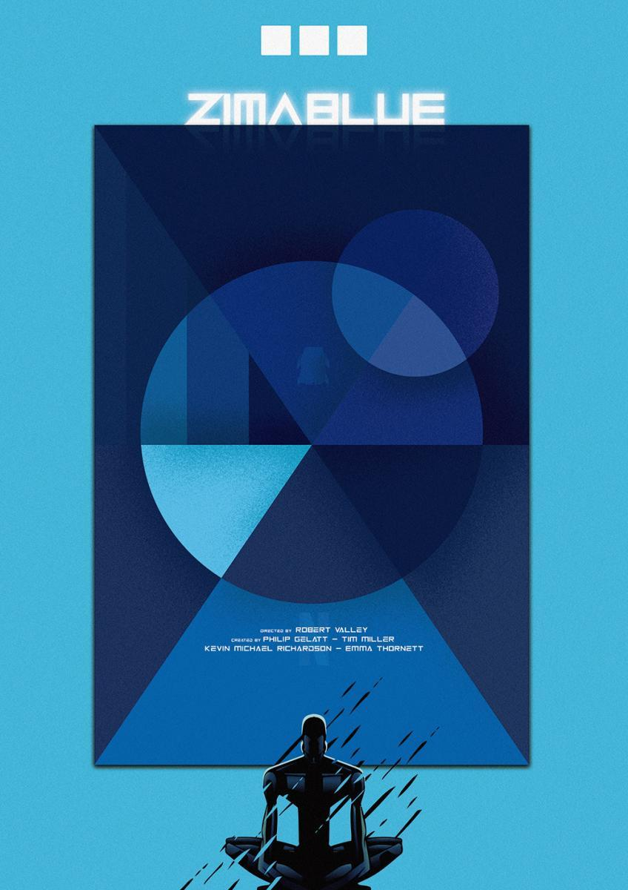
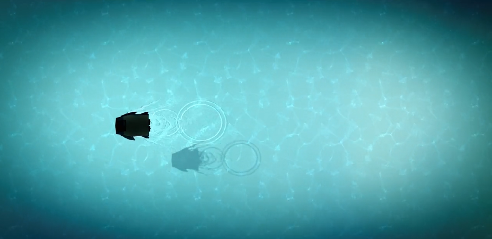
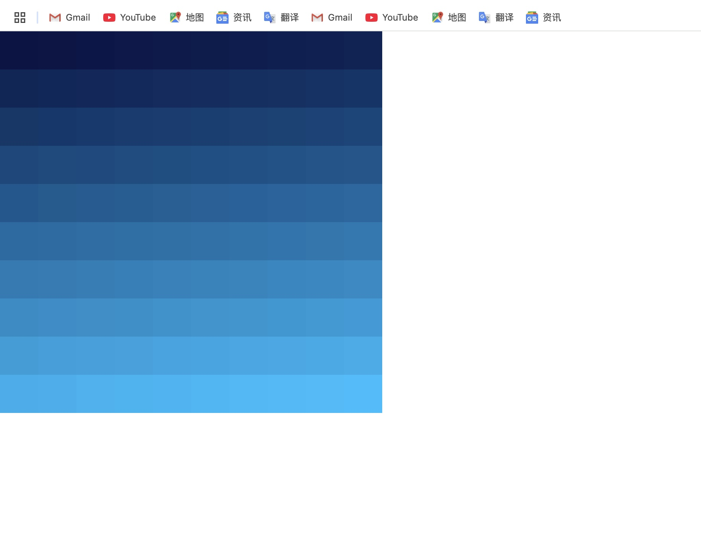

# Quiz 8 – Zima Blue Inspired Design

##  Part 1: Imaging Technique Inspiration

**Inspiration:** *Zima Blue* from *Love, Death & Robots*

The visual style of *Zima Blue* inspires me with its minimalist geometric shapes and calm monochrome palette. I’m especially drawn to the clean grid composition and the deep blue tones in the first image, and the serene, abstract water environment in the second. I want to use simple rectangles, smooth color transitions, and symmetry to reflect the story’s theme of returning to one’s origin. This aesthetic helps me explore visual clarity and philosophical meaning using only basic shapes and motion.

**Images:**

---

## Part 2: Coding Technique Exploration

To bring the visual feeling of *Zima Blue* into my project, I plan to use `for` loops to draw a grid of rectangles and apply `lerpColor()` to gradually shift each block from dark navy to bright cyan. Combined with `setInterval()` or a state variable, this can animate a slow transition that feels calm and philosophical. Mouse interaction can trigger a rearrangement or color shift, reflecting the idea of returning to origin. This technique helps me simulate both the minimal aesthetic and the layered emotion of the original artwork using simple shapes and color logic.

**Code Reference:**  
[https://p5js.org/examples/repetition-color-interpolation/](https://p5js.org/examples/repetition-color-interpolation/)

**Screenshot:**

